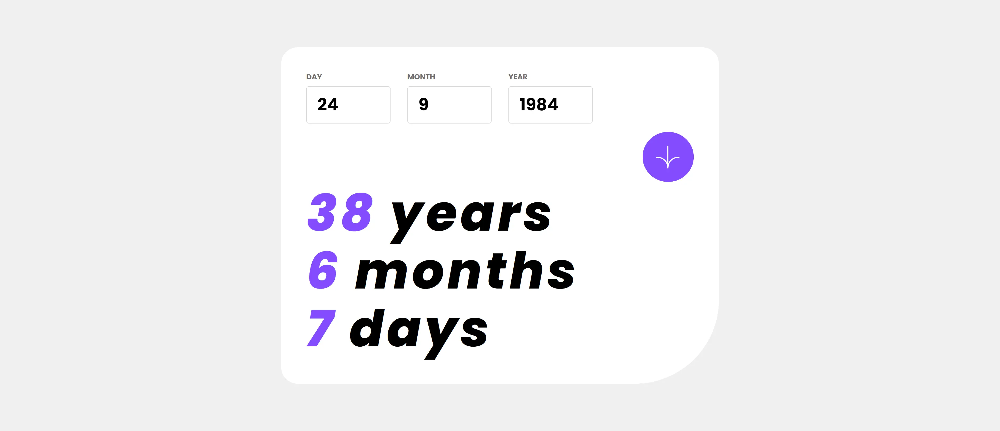

# 🗓️ Age calculator app - Frontend Mentor 📆

This is a solution to the [Age calculator app](https://www.frontendmentor.io/challenges/age-calculator-app-dF9DFFpj-Q) challenge made with React and pure CSS. Frontend Mentor challenges help you improve your coding skills by building realistic projects.

[Solution][solution-url] . [Live Page][live-page]

Table of contents

-   [Overview](#overview)
    -   [The challenge](#the-challenge)
    -   [Screenshots](#screenshots)
    -   [Links](#links)
-   [My process](#my-process)
    -   [Built with](#built-with)
-   [Author](#author)

## Overview

### The challenge

Users should be able to:

- View an age in years, months, and days after submitting a valid date through the form
- Receive validation errors if:
  - Any field is empty when the form is submitted
  - The day number is not between 1-31
  - The month number is not between 1-12
  - The year is in the future
  - The date is invalid e.g. 31/04/1991 (there are 30 days in April)
- View the optimal layout for the interface depending on their device's screen size
- See hover and focus states for all interactive elements on the page
- **Bonus**: See the age numbers animate to their final number when the form is submitted

### Screenshots

<table>
        <tr>
		    <td>
                
            </td>
			<td>
                
            </td>
            <td>
                
            </td>
        </tr>
</table>

### Links

-   [Solution][solution-url]
-   [Live Page][live-page]

## My process

### Built with

-   Semantic HTML5 markup
-   Flexbox
-   Desktop-first workflow
-   [React](https://reactjs.org/) - JS library
-	 [Vite](https://vitejs.dev/) - Build tool

(<a href="#top">back to top</a>)

## Author

-   Instagram - [@cosmo_art0](https://www.instagram.com/cosmo_art0/)
-   Frontend Mentor - [@CosmoArt](https://www.frontendmentor.io/profile/cosmoart)
-   Twitter - [@CosmoArt0](https://twitter.com/cosmoart0)
-   My personal page - [cosmoart.vercel.app](https://cosmoart.vercel.app)

(<a href="#top">back to top</a>)

[live-page]: https://agescalculator.vercel.app
[solution-url]: https://github.com/cosmoart
